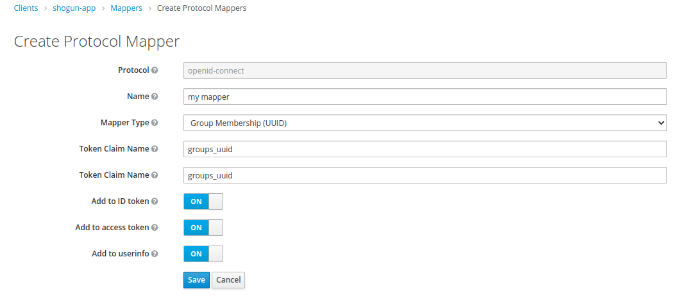

# Keycloak OpenId Connect (OIDC) group uuid mapper
Custom protocol claim mapper that adds the uuids (keycloak) if the groups the user is assigned to the login token.
Herewith, the group association is directly available in the session context of the user as a list of UUIDs.

## Keycloak version

This plugin currently uses the keycloak library in version 15, so it should be compatible with keycloak instances up to that version.

## Install
To build the jar file, simply run
```bash
mvn clean package
```

Using the official keycloak docker image you can create a mount of the directory /opt/jboss/keycloak/standalone/deployments and copy the jar there.

If you use [`shogun-docker`](https://github.com/terrestris/shogun-docker), you can simply mount the mapper in the following way (artifact has to be copied to subfolder `shogun-keycloak/modules` first):
```yaml
...
shogun-keycloak:
  image: jboss/keycloak:12.0.4@sha256:67e0c88e69bd0c7aef972c40bdeb558a974013a28b3668ca790ed63a04d70584
  ports:
    - 8000:8080
  volumes:
    - ./shogun-keycloak/modules/oidc-group-uuid-protocol-mapper-0.0.1-SNAPSHOT.jar:/opt/jboss/keycloak/standalone/deployments/oidc-group-uuid-protocol-mapper.jar
...
```

## Usage
After successful installation the mapper is available for any client in tab "Mappers" (see also in the official [keycloak documentation](https://www.keycloak.org/docs/latest/server_admin/index.html#_protocol-mappers)).

Simply create new protocol mapper -> select "Group Membership (UUID)" -> insert name -> done.


